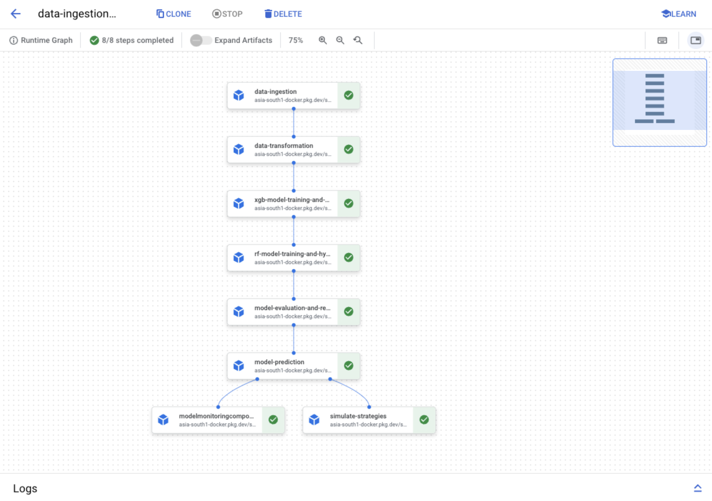

# Max Returns MLOps
### End-to-End MLOps project for predicting top daily stocks to invest in to optimize 5-day return.

## Overview
This repository contains an end-to-end MLOps pipeline designed to predict the top daily stocks to invest in, with the goal of optimizing a 5-day return. The project leverages various financial data sources to perform data ingestion and transformation, and it trains machine learning models, optimizes hyperparameters and predicts using an ensemble approach. The final pipeline runs on Vertex AI using Kubeflow Pipelines, with each component containerized and managed via Google Artifact Registry.

### Google Cloud Services Used:
- Vertex AI Workbench: For development and experimentation.
- Vertex AI Pipelines: For orchestrating the MLOps workflow.
- Google Cloud Storage (GCS): For storing data and artifacts.
- Google Cloud SQL (PostgreSQL): For managing MLflow tracking data and Evidently AI metrics.
- Artifact Registry: For storing Docker images of the pipeline components.

### Components and Tools:
- Data Ingestion: Custom scripts, GCS, Docker
- Data Transformation: Custom scripts, GCS, Docker
- Model Training: Custom scripts, Vertex AI, MLflow, Docker
- Model Evaluation: Custom scripts, Vertex AI, MLflow, Docker
- Prediction: Custom scripts, Vertex AI, GCS, Docker
- Orchestration: Vertex AI Pipelines, Kubeflow
- Monitoring: PostgreSQL, Grafana, Evidently AI
    
## Repository Structure
 - src: Contains different components of the pipeline.
    - Each folder within src contains a configuration manager class that reads and manages configuration from the config_pred.yaml file.
    - Each component/folder has its own Pipfile and Dockerfile.
    - Docker images of each component are pushed to Artifact Registry and used as Kubeflow components in the Vertex AI pipeline.
 - config: Contains YAML configuration files for different components.
    - compile_pipeline.py: Compiles all hte components of the pipeline. 
    - run_pipeline.py: Runs the final end-to-end pipeline.

## Pipeline Stages
### Data Ingestion (data_ingestion.py):
 - Downloads and processes financial data.
 - Saves data as Parquet files.
### Data Transformation (data_transformation.py):
 - Adds technical indicators and combines data into a single DataFrame. Transformed data ready for model training.
### Model Training (model_trainer.py):
 - Trains Random Forest and XGBoost models.
 - Uses Hyperopt for hyperparameter optimization.
 - Logs models and metrics to MLflow.
### Model Evaluation (model_evaluation.py):
 - Evaluates models based on precision scores.
 - Selects and registers the best model with MLflow.
### Prediction (model_predict.py):
 - Uses the registered model for final predictions (mean of predicted probability of best rf and xgb models).
 - Stores top 10 stock predictions as a CSV file in the /model_preds folder.
### Moitoring (model_monintor.py):
 - Uses evidently ai to calculate drift and other metrics on target/prediction columns.
 - Logs metrics to PostgreSQL on Google Cloud, which are visualized using custom Grafana dashboards.
### Simulating Strategies (simulate_strategy.py)
 - Calculates various financial indicators, applies stock selection criteria, and evaluates the performance of a trading strategy.



## Usage
1. Setup Environment:
   - Create a Vertex AI Workbench instance and a PostgreSQL database in Google Cloud SQL for MLflow, and Evidently AI.
   - Clone the repository.
   - Set up Google Cloud SDK and authenticate.
2. Configuration:
   - Configure the config_pred.yaml file with the necessary parameters, including paths to GCS buckets and database connection details.
3. Build and Deploy Docker Images:
   - For each component in src, build and push Docker images to Google Artifact Registry.
   ```bash
   docker build -t your-region-docker.pkg.dev/your-project-id/pipeline_stage:latest .
   docker push your-region-docker.pkg.dev/your-project-id/pipeline_stage:latest
   ```
   - Update yaml files in config folder with image info from previous step.
4. Run MLflow and Grafana:
   - Start the MLflow server on a Vertex AI Workbench instance.
   ```bash
   mlflow server --backend-store-uri postgresql://<username>:<password>@<privateIP>:<port>/<dbname> --default-artifact-root <gcs-bucket-location> --host 0.0.0.0 --port 5000
   ```
   - Install and run Grafana on the Vertex AI Workbench instance. Connect it to the PostgreSQL database for visualizing model metrics.
5. Compile and Run Pipeline:
   - Update compile_pipeline.py and run_pipeline.py with your Google Cloud project ID, bucket name, region, etc.
   - Compile the pipeline using the Vertex AI SDK.
   ```bash
   python compile_pipeline.py
   ```
   - Upload the compiled pipeline JSON to a Google Cloud Storage bucket.
   ```bash
   gsutil cp ml_pipeline.json gs://bucket-name/pipeline_root/config/ml_pipeline.json
   ```
   - Run the pipeline job using the Vertex AI SDK.
   ```bash
   python run_pipeline.py
   ```
6. Track and Monitor:
   - Track the pipeline job on the Google Cloud Platform using Vertex AI pipelines (link will be available after running run_pipeline script).
   - Monitor MLflow experiments at the URL specified in config_pred.yaml (port 5000).
   - Visualize model metrics on the Grafana dashboard at the URL specified in config_pred.yaml (port 3000). Evidently dashboards are logged and can also be viewed from MLflow ui. 


## Deployment
Docker images for each component are built and pushed to Google Artifact Registry. These images are then used as components in the Vertex AI pipeline.
### Deploying the Vertex AI pipeline (steps 5 above)
    - Prepare Your Pipeline Code (compile_pipeline.py): Ensure your pipeline code is ready and you have defined your components and pipeline using the Kubeflow Pipelines SDK.
    - Compile the Pipeline (ml_pipeline.json): Compile your pipeline into a JSON format that Vertex AI can understand.
    - Upload the Pipeline Template to GCS: Store your compiled pipeline JSON on Google Cloud Storage (GCS).
    - Create and Run the Pipeline Job (run_pipeline.py): Use the Vertex AI SDK to create and run the pipeline job.

## Requirements
- Google Cloud SDK
- Vertex AI
- Kubeflow Pipelines
- Docker
- MLflow
- Evidently AI
- Grafana

## Contributing
Contributions are welcome! Please fork the repository and submit a pull request for any improvements or bug fixes.

## License
This project is licensed under the MIT License.